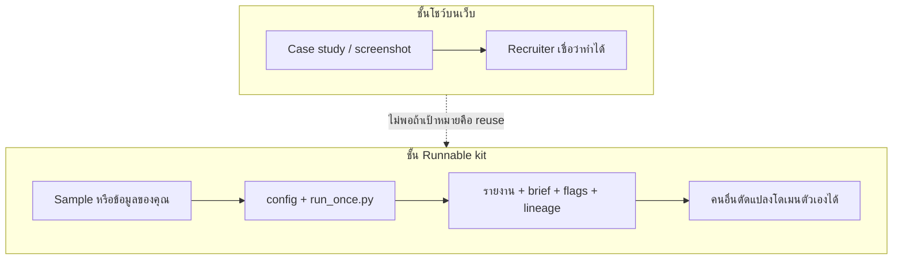
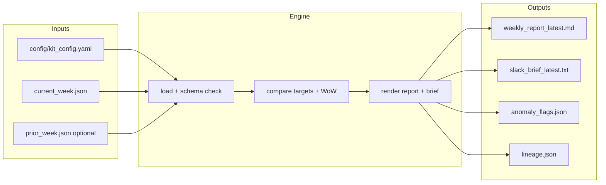
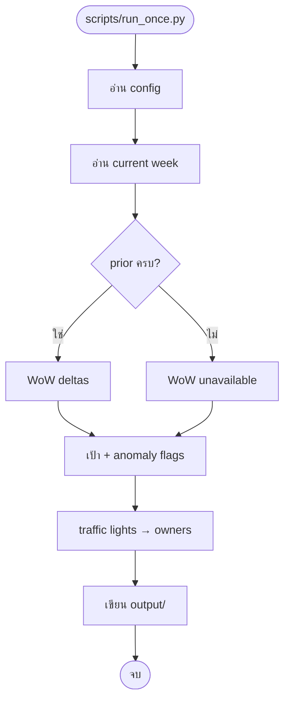
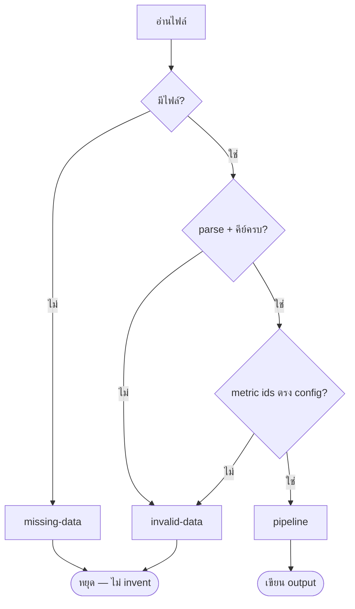
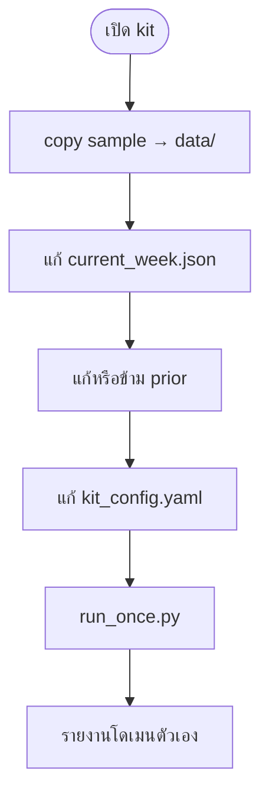
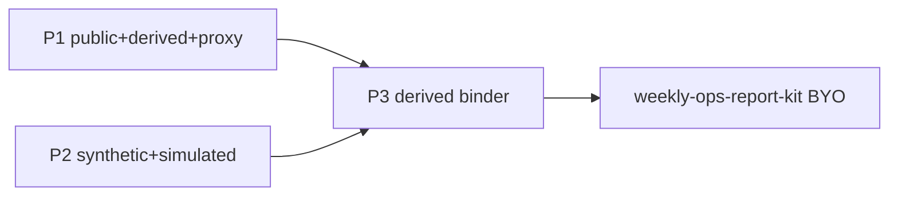
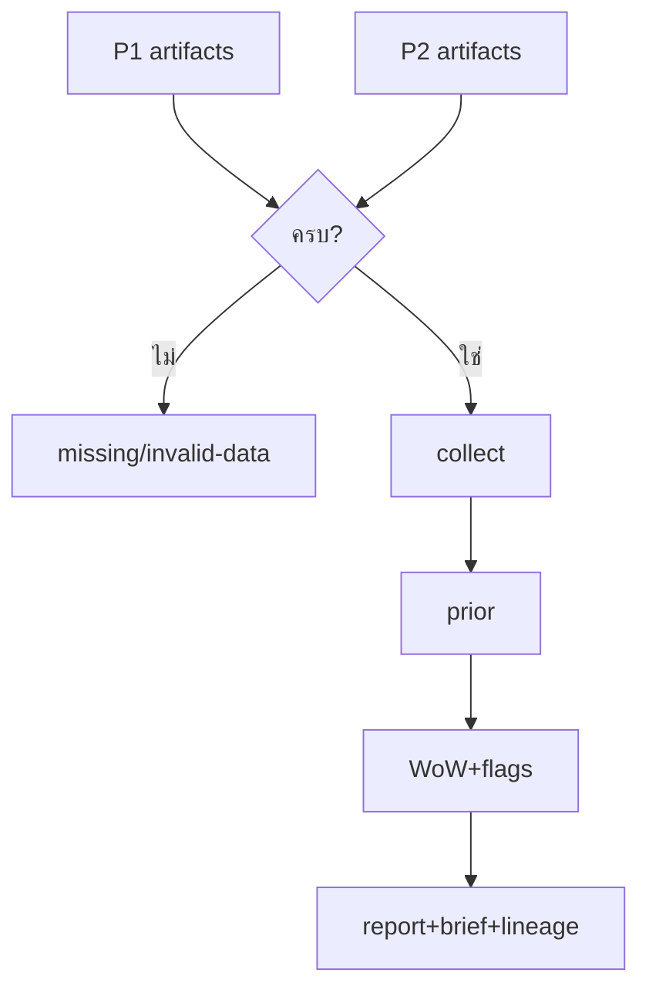
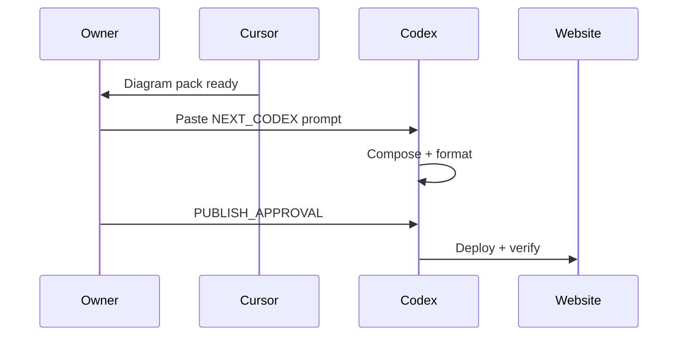
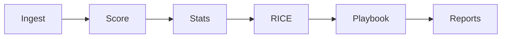
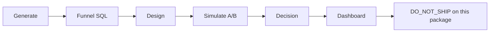

# All diagrams (preview)

Copy Mermaid blocks into a Mermaid live editor, or let Codex render to SVG for the site.
Canonical brief: [../diagram-notes.md](../diagram-notes.md)

---

## Portfolio vs reusable kit

---

## Data to report

---

## Weekly run steps

---

## Stop on missing data

---

## Use your data

---

## Travel to reusable kit

---

## Weekly report assembly

---

## Publish handoff

---

## Content quality workflow

---

## Funnel experiment workflow

